# Database Schema

```mermaid
erDiagram
    %% マスタ系
    money_forward_profiles {
        text id PK
        text name
        boolean enabled
        text last_scraped_at
        text last_status
        text last_error
        text created_at
        text updated_at
    }

    groups {
        text id PK "profile_id:mf_group_id"
        text profile_id FK "INDEX, CASCADE"
        text mf_group_id
        text name
        boolean is_current
        text last_scraped_at
        text created_at
        text updated_at
    }

    group_accounts {
        integer id PK
        text profile_id FK "CASCADE"
        text group_id FK "INDEX, PROFILE PAIR, CASCADE"
        integer account_id FK "INDEX, PROFILE PAIR, CASCADE"
        text created_at
        text updated_at
    }

    institution_categories {
        integer id PK
        text name UK
        integer display_order
        text created_at
        text updated_at
    }

    accounts {
        integer id PK
        text profile_id FK "INDEX, CASCADE"
        text mf_id
        text name
        text type
        text institution
        integer category_id FK "SET NULL"
        text created_at
        text updated_at
        boolean is_active
    }

    asset_categories {
        integer id PK
        text name UK
        text created_at
        text updated_at
    }

    %% ステータス系
    account_statuses {
        integer id PK
        integer account_id FK,UK "CASCADE"
        text status "ok/error/updating/suspended/unknown"
        text last_updated
        integer total_assets
        text error_message
        text created_at
        text updated_at
    }

    %% 銘柄・資産マスタ
    holdings {
        integer id PK
        text profile_id FK "INDEX, CASCADE"
        text mf_id
        integer account_id FK "INDEX, CASCADE"
        integer category_id FK "SET NULL"
        text name
        text code
        text type
        text liability_category
        text created_at
        text updated_at
        boolean is_active
    }

    stock_market_data {
        integer id PK
        text source
        text external_security_id UK "source + external_security_id"
        text normalized_code UK "source + normalized_code"
        text market
        text name
        text industry_name "INDEX"
        text listing_status
        text mapping_status "INDEX"
        integer forecast_fiscal_year
        text forecast_quarter
        real forecast_dps_raw
        real forecast_dps_adjusted
        text forecast_share_basis
        text forecast_period_basis
        text forecast_source_disclosure_date
        text forecast_as_of
        text last_mapped_at
        text last_forecast_fetched_at
        text last_history_fetched_at
        text last_error_code
        text created_at
        text updated_at
    }

    stock_dividend_history {
        integer id PK
        integer stock_market_data_id FK "CASCADE"
        text provider_event_id
        text economic_event_key
        text event_version_key UK "source + event_version_key"
        integer revision
        integer fiscal_year "INDEX"
        integer payment_year
        text period
        text status
        real dps_raw
        real dps_adjusted
        text period_basis
        text announced_at
        text record_date
        text ex_date
        text payment_date "INDEX"
        text payment_date_precision
        text source
        text as_of
        text created_at
        text updated_at
    }

    market_data_sync_statuses {
        integer id PK
        text source
        text normalized_code
        text stage UK "source + normalized_code + stage"
        text status "INDEX"
        text error_code
        text last_attempted_at
        text last_success_at
        text next_allowed_at
        integer ttl_seconds
        text as_of
        text created_at
        text updated_at
    }

    market_data_request_budgets {
        integer id PK
        text source
        text budget_window_key UK "source + budget_window_key"
        text provider_timezone
        integer daily_limit
        integer soft_limit
        integer safety_reserve
        integer requests_reserved
        integer requests_completed
        text window_reset_at
        text created_at
        text updated_at
    }

    %% スナップショット系
    daily_snapshots {
        integer id PK
        text group_id FK "CASCADE"
        text date "INDEX"
        boolean refresh_completed
        text created_at
        text updated_at
    }

    holding_values {
        integer id PK
        integer holding_id FK "CASCADE"
        integer snapshot_id FK "CASCADE"
        integer amount
        real quantity
        real unit_price
        real avg_cost_price
        integer daily_change
        integer unrealized_gain
        real unrealized_gain_pct
        text created_at
        text updated_at
    }

    %% 収支系
    transactions {
        integer id PK
        text profile_id FK "INDEX, CASCADE"
        text mf_id
        text date "INDEX"
        integer account_id FK "INDEX, CASCADE"
        text category
        text sub_category
        text raw_category
        text raw_sub_category
        text description
        integer amount
        text type
        boolean is_transfer
        boolean is_excluded_from_calculation
        text transfer_target
        integer transfer_target_account_id FK "SET NULL"
        text created_at
        text updated_at
    }

    %% 資産履歴系
    asset_history {
        integer id PK
        text group_id FK "INDEX, CASCADE"
        text date
        integer total_assets
        integer change
        text created_at
        text updated_at
    }

    asset_history_categories {
        integer id PK
        integer asset_history_id FK "CASCADE"
        text category_name
        integer amount
        text created_at
        text updated_at
    }

    %% 予算系
    spending_targets {
        integer id PK
        text group_id FK "INDEX, CASCADE"
        integer large_category_id
        text category_name
        text type
        text created_at
        text updated_at
    }

    %% 分析系
    analytics_reports {
        integer id PK
        text group_id FK "INDEX, CASCADE"
        text date
        text summary
        text savings_insight
        text investment_insight
        text spending_insight
        text balance_insight
        text liability_insight
        text model
        text created_at
        text updated_at
    }

    %% リレーション
    money_forward_profiles ||--o{ groups : "has many (CASCADE)"
    money_forward_profiles ||--o{ accounts : "has many (CASCADE)"
    money_forward_profiles ||--o{ holdings : "has many (CASCADE)"
    money_forward_profiles ||--o{ transactions : "has many (CASCADE)"
    money_forward_profiles ||--o{ group_accounts : "has many (CASCADE)"
    groups ||--o{ daily_snapshots : "has many (CASCADE)"
    groups ||--o{ group_accounts : "has many (CASCADE)"
    groups ||--o{ asset_history : "has many (CASCADE)"
    groups ||--o{ spending_targets : "has many (CASCADE)"
    groups ||--o{ analytics_reports : "has many (CASCADE)"
    accounts ||--o{ group_accounts : "has many (CASCADE)"
    accounts ||--o{ transactions : "has many (CASCADE)"
    accounts ||--o{ transactions : "transfer target (SET NULL)"
    institution_categories ||--o{ accounts : "has many (SET NULL)"
    accounts ||--o{ holdings : "has many (CASCADE)"
    accounts ||--o| account_statuses : "has one (CASCADE)"
    asset_categories ||--o{ holdings : "has many (SET NULL)"
    holdings ||--o{ holding_values : "has many (CASCADE)"
    daily_snapshots ||--o{ holding_values : "has many (CASCADE)"
    asset_history ||--o{ asset_history_categories : "has many (CASCADE)"
    stock_market_data ||--o{ stock_dividend_history : "has many (CASCADE)"
```

## Indexes

| Table                       | Index                                           | Type   | Columns                           |
| --------------------------- | ----------------------------------------------- | ------ | --------------------------------- |
| groups                      | groups_profile_mf_group_idx                     | UNIQUE | profile_id, mf_group_id           |
| groups                      | groups_profile_id_pair_idx                      | UNIQUE | profile_id, id                    |
| groups                      | groups_profile_id_idx                           | INDEX  | profile_id                        |
| group_accounts              | group_accounts_group_account_idx                | UNIQUE | group_id, account_id              |
| group_accounts              | group_accounts_group_id_idx                     | INDEX  | group_id                          |
| group_accounts              | group_accounts_account_id_idx                   | INDEX  | account_id                        |
| daily_snapshots             | daily_snapshots_date_idx                        | INDEX  | date                              |
| holding_values              | holding_values_holding_snapshot_idx             | UNIQUE | holding_id, snapshot_id           |
| holdings                    | holdings_profile_mf_id_idx                      | UNIQUE | profile_id, mf_id                 |
| holdings                    | holdings_profile_id_idx                         | INDEX  | profile_id                        |
| holdings                    | holdings_account_id_idx                         | INDEX  | account_id                        |
| accounts                    | accounts_profile_mf_id_idx                      | UNIQUE | profile_id, mf_id                 |
| accounts                    | accounts_profile_id_pair_idx                    | UNIQUE | profile_id, id                    |
| accounts                    | accounts_profile_id_idx                         | INDEX  | profile_id                        |
| accounts                    | accounts_category_id_idx                        | INDEX  | category_id                       |
| transactions                | transactions_profile_mf_id_idx                  | UNIQUE | profile_id, mf_id                 |
| transactions                | transactions_profile_id_idx                     | INDEX  | profile_id                        |
| transactions                | transactions_profile_date_idx                   | INDEX  | profile_id, date                  |
| transactions                | transactions_profile_account_idx                | INDEX  | profile_id, account_id            |
| transactions                | transactions_date_idx                           | INDEX  | date                              |
| transactions                | transactions_account_id_idx                     | INDEX  | account_id                        |
| stock_market_data           | stock_market_data_source_external_idx           | UNIQUE | source, external_security_id      |
| stock_market_data           | stock_market_data_source_code_idx               | UNIQUE | source, normalized_code           |
| stock_market_data           | stock_market_data_industry_idx                  | INDEX  | industry_name                     |
| stock_market_data           | stock_market_data_mapping_status_idx            | INDEX  | mapping_status                    |
| stock_dividend_history      | stock_dividend_history_source_event_version_idx | UNIQUE | source, event_version_key         |
| stock_dividend_history      | stock_dividend_history_stock_fiscal_idx         | INDEX  | stock_market_data_id, fiscal_year |
| stock_dividend_history      | stock_dividend_history_payment_date_idx         | INDEX  | payment_date                      |
| market_data_sync_statuses   | market_data_sync_statuses_source_code_stage_idx | UNIQUE | source, normalized_code, stage    |
| market_data_sync_statuses   | market_data_sync_statuses_status_idx            | INDEX  | status                            |
| market_data_request_budgets | market_data_request_budgets_source_window_idx   | UNIQUE | source, budget_window_key         |
| asset_history               | asset_history_group_date_idx                    | UNIQUE | group_id, date                    |
| asset_history               | asset_history_group_id_idx                      | INDEX  | group_id                          |
| asset_history_categories    | asset_history_categories_history_category_idx   | UNIQUE | asset_history_id, category_name   |
| spending_targets            | spending_targets_group_category_idx             | UNIQUE | group_id, large_category_id       |
| spending_targets            | spending_targets_group_id_idx                   | INDEX  | group_id                          |
| analytics_reports           | analytics_reports_group_date_idx                | UNIQUE | group_id, date                    |
| analytics_reports           | analytics_reports_group_id_idx                  | INDEX  | group_id                          |

## ON DELETE Actions

| Parent Table           | Child Table              | Action   |
| ---------------------- | ------------------------ | -------- |
| money_forward_profiles | groups                   | CASCADE  |
| money_forward_profiles | accounts                 | CASCADE  |
| money_forward_profiles | holdings                 | CASCADE  |
| money_forward_profiles | transactions             | CASCADE  |
| money_forward_profiles | group_accounts           | CASCADE  |
| accounts               | account_statuses         | CASCADE  |
| accounts               | holdings                 | CASCADE  |
| accounts               | transactions             | CASCADE  |
| accounts               | transactions (transfer)  | SET NULL |
| accounts               | group_accounts           | CASCADE  |
| groups                 | daily_snapshots          | CASCADE  |
| groups                 | group_accounts           | CASCADE  |
| groups                 | asset_history            | CASCADE  |
| groups                 | spending_targets         | CASCADE  |
| groups                 | analytics_reports        | CASCADE  |
| holdings               | holding_values           | CASCADE  |
| daily_snapshots        | holding_values           | CASCADE  |
| asset_history          | asset_history_categories | CASCADE  |
| institution_categories | accounts                 | SET NULL |
| asset_categories       | holdings                 | SET NULL |
| stock_market_data      | stock_dividend_history   | CASCADE  |

## Multi-profile migration policy

`0002_aromatic_exodus.sql`は、既存行へ暗黙の`primary` profileを割り当てません。旧schemaの
`accounts`、`holdings`、`transactions`、`groups`、`group_accounts`のいずれかに行がある場合、migration冒頭の
`CHECK` guardで変更前に失敗させるfail-closed設計です。multi-profile対応へ移行するときは、
対象が正しいことを確認したうえで旧DBを退避し、空のDBへfresh migrationを適用してください。
実データDBをテストや自動migration検証へ流用してはいけません。
